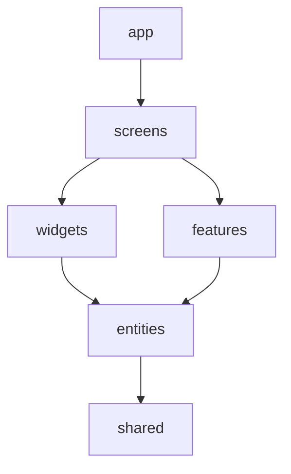

# Feature-Sliced Design

RepoLens organiza la interfaz por responsabilidades y funcionalidades con dependencias descendentes.

* `app`: entrada del framework, layout, estilos globales y composición.
* `screens/dashboard`: capa Pages de FSD. Se llama screens para evitar que el framework interprete `pages` como un segundo router.
* `widgets/repository-list`: tabla y paginación controlada.
* `features/explore-account`: búsqueda, cancelación, estados de carga y registro WebMCP.
* `features/filter-repositories`: estado y aplicación de filtros y ordenación.
* `entities/github`: modelos de cuenta/repositorio/actividad, normalización, selectores puros y cliente de GitHub con caché. Una sola entidad compuesta evita dependencias laterales entre slices.
* Shared físico existente: `components/ui`, `hooks` y `lib/utils.ts`. Se conservan los archivos e imports del catálogo instalado; cumplen el papel de Shared, no contienen reglas del dashboard.

Cada slice publica `index.ts`; otros slices consumen esa interfaz. No hay importaciones entre features hermanas, ni desde entities hacia React, widgets o features. La pantalla compone búsqueda y filtros sin acoplarlos entre sí.

`npm test` verifica el contrato de GitHub y las reglas de importación. `npm run typecheck` y `npm run build` validan la integración con el framework. Se conservan los límites de consulta, URLs seguras, caché de cinco minutos, advertencias parciales y cancelación.
